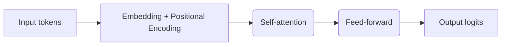
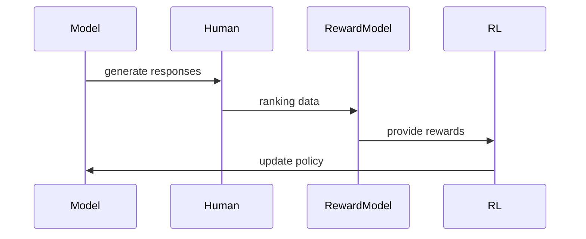

# Foundational LLMs & Text Generation

This chapter explains the foundations of large language models (LLMs) and text generation. It covers the core concepts, model architectures, training objectives, decoding strategies, safety considerations, and practical examples you can run locally or with hosted APIs.

The structure below mirrors the provided whitepaper while adding diagrams, runnable snippets, and clarifying explanations to help readers build intuition and practical skills.

## Chapter structure (what you'll learn)

- Motivation: why LLMs are central to modern AI systems
- Key concepts: tokens, tokenization, context windows, prompts
- Architecture: the transformer building blocks and how they enable language modeling
- Training objectives: causal LM, masked LM, denoising and instruction tuning
- Decoding & generation: greedy, beam, sampling, temperature, nucleus/top-p
- Fine-tuning & alignment: supervised fine-tuning, instruction tuning, RLHF
- Evaluation & metrics: perplexity, human evaluation, automated metrics
- Safety, robustness and limitations
- Practical examples: Hugging Face and LLM API patterns
- Exercises and further reading

---

## 1. Motivation

Large language models learn statistical patterns of language from huge corpora. They provide a flexible, general-purpose capability: given a sequence of text (the prompt), predict the next tokens. This simple capability scales into powerful behaviors: summarization, translation, question-answering, code completion, and more. In agent systems, LLMs often serve as the "policy" or reasoning component that maps observations and memory to actions.

Practical goals for this chapter:

- Build intuition about why transformers work for language tasks.
- Understand trade-offs in model size, latency, and cost.
- Learn safe and reproducible ways to use LLMs in experiments.

## 2. Key concepts and terminology

### Tokens and tokenization

- A token is the atomic unit the model predicts (subword, byte pair, or byte-level unit). Tokenization converts text into tokens.
- Common tokenizers: Byte-Pair Encoding (BPE), WordPiece, byte-level BPE. Each trades off vocabulary size and slice granularity.
- Token count matters: context length and billing (API) are measured in tokens.

Visual: tokenization example

```text
Text:  "Large language models are powerful."
Tokens: ["Large", " language", " models", " are", " powerful", "."]  (example using subword tokenizer)
```

### Context window & prompt

- Context window: maximum number of tokens a model can see at once (e.g., 2k, 8k, 32k+). Longer windows allow multi-document reasoning but increase compute and memory.
- Prompt engineering: designing the input (instructions, examples, system messages) to elicit desired behavior — includes few-shot prompting (examples in prompt) and zero-shot prompting.

### Pretraining vs fine-tuning

- Pretraining: train a model on large corpora with a self-supervised objective (predict next token or masked tokens).
- Fine-tuning: adapt the pretrained model to a task using labeled examples or specialized objectives.

### Perplexity and other evaluation concepts

- Perplexity: a measure of how well a probabilistic model predicts a sample. Lower is better; not always correlated with downstream task performance.
- Other metrics: BLEU/ROUGE (n-gram overlap), BERTScore, and human evaluation (often the gold standard).

## 3. Transformer architecture (high level)

Transformers are the dominant architecture for LLMs. Key pieces:

- Token embeddings + positional encodings
- Self-attention: pairwise token interactions to compute context-aware representations
- Feed-forward blocks: local transformations per position
- Stacking layers and residual connections

Mermaid diagram — simplified transformer encoder/decoder flow:



Notes:

- For causal language modeling (auto-regressive generation) we use a decoder-only transformer (masked self-attention to prevent seeing future tokens).
- For bidirectional tasks (masked LM), encoder or encoder-decoder variants are used.

## Model evolution — concise timeline

A short, practical timeline to ground historical context and terminology you'll see in research and tooling:

- 2017 — "Attention Is All You Need" (Vaswani et al.) introduces Transformers.
- 2018 — GPT-1 demonstrates transfer via large-scale unsupervised pretraining.
- 2018 — BERT introduces masked LM and strong feature representations for understanding tasks.
- 2019–2020 — GPT-2 / GPT-3 scale autoregressive generation and few-shot learning emerges.
- 2021–2022 — Instruction tuning and RLHF become common for helpfulness (InstructGPT lineage).
- 2022–2024 — PaLM, Chinchilla, LLaMA, and other research models emphasize scaling laws and data quality.
- 2023+ — Multimodal and MoE experiments (e.g., Gemini-class models) push long-context and routing techniques.

Use this timeline as a quick glossary when reading papers or model release notes.

## 4. Training objectives

### Causal LM (auto-regressive)

- Objective: maximize likelihood of next token given previous tokens. Used by GPT-style models.

Mathematically:

$$\\mathcal{L} = -\\sum_{t=1}^T \\log p(x_t | x_{<t})$$

### Masked LM / Denoising

- Mask tokens and predict them (BERT), or use corrupted inputs and learn to reconstruct (BART, T5). These support bidirectional context.

### Instruction tuning & supervised fine-tuning

- Supervised finetuning uses labeled input-output pairs (prompt → desired output) to align models with tasks.

### Reinforcement Learning from Human Feedback (RLHF)

- RLHF pipeline (simplified):
  1. Collect model outputs for prompts.

2.  Humans rank outputs.
3.  Train a reward model from rankings.
4.  Use RL (PPO) to optimize policy against the reward model.

Mermaid sequence diagram (RLHF simplified):



## 5. Decoding & generation strategies

After the model produces logits for the next token, decoding turns those logits into tokens. Choice of decoding greatly affects output quality.

- Greedy: pick highest-probability token. Fast, often repetitive.
- Beam search: keep top-k hypotheses, expands search; good for deterministic tasks but can be costly and produce generic outputs.
- Sampling: sample from the distribution to increase diversity.
  - Temperature: scale logits to make distribution sharper (low T) or flatter (high T).
  - Top-k: sample from top k tokens.
  - Top-p (nucleus): sample from smallest set whose cumulative probability >= p.

Best practice: use sampling with tuned temperature and top-p for creative generation; use beam or greedy for structured predictions.

## 6. Common models & toolkits

- GPT-family: decoder-only causal LMs (GPT-2, GPT-3, GPT-4 — closed or partially closed variants)
- LLaMA, OPT, BLOOM: open-source large models with various licenses
- PaLM, Chinchilla: research-scale models with variants
- Toolkits: Hugging Face Transformers, Hugging Face Accelerate, transformers + PEFT (parameter-efficient fine-tuning), OpenAI SDKs, LangChain for orchestration

- GPT-family: decoder-only causal LMs (GPT-2, GPT-3, GPT-4 — closed or partially closed variants)
- LLaMA, OPT, BLOOM: open-source large models with various licenses
- PaLM, Chinchilla: research-scale models with variants
- Gemini / Mixture-of-Experts (MoE): models that route tokens to specialist sub-networks to scale efficiently
- Gopher, Mistral, and other open-source research models that push data quality and efficiency
- Toolkits: Hugging Face Transformers, Hugging Face Accelerate, transformers + PEFT (parameter-efficient fine-tuning), OpenAI SDKs, LangChain for orchestration

Notes on evolution and architecture choices

- Mixture-of-Experts (MoE) models (used in some recent large-model families) activate only a subset of parameters per token via gating, improving parameter efficiency. This can give the benefits of very large parameter counts while keeping inference costs manageable for some workloads.
- Long-context models: newer models support very long contexts (tens of thousands up to a million tokens in research variants), enabling multi-document reasoning and retrieval-augmented pipelines.
- GPT-family: decoder-only causal LMs (GPT-2, GPT-3, GPT-4 — closed or partially closed variants)
- LLaMA, OPT, BLOOM: open-source large models with various licenses
- PaLM, Chinchilla: research-scale models with variants
- Toolkits: Hugging Face Transformers, Hugging Face Accelerate, transformers + PEFT (parameter-efficient fine-tuning), OpenAI SDKs, LangChain for orchestration
Expanded notes and practical implications

Mixture-of-Experts (MoE)

- MoE architectures route tokens to a small subset of expert subnetworks via a learned gating mechanism. Only a few experts are active per token, which lets models present extremely large parameter counts while keeping per-token compute lower.
- Practical trade-offs: MoE can reduce inference FLOPs for certain workloads but adds complexity (routing, expert balancing, larger memory footprint for storage, and potential latency variance). It's well-suited where a model can benefit from specialized sub-networks (e.g., different languages, domains).

Long-context and retrieval

- Long-context models (32k, 100k+ tokens) enable multi-document reasoning, chaining, and document-level summarization. When you need factual grounding, combine long-context models with retrieval-augmented generation (RAG): fetch relevant documents, prepend or condition the model, then generate.

Inference optimizations (expanded)

- FlashAttention: an attention implementation that reduces memory I/O and increases throughput, often used during both training and inference to accelerate transformer attention blocks.
- KV (key-value) caching / prefix caching: in chat-style interactions, cache the model's past key/value tensors so repeated context does not need full re-computation — critical for low-latency conversational apps.
- Speculative decoding: run a small fast model to predict several tokens, then verify or score them with a larger model to reduce latency while keeping quality.
- Quantization and pruning: reduce numeric precision (e.g., FP16, int8, 4-bit quantization) to shrink memory footprint and increase speed. QLoRA combines quantization with LoRA-style low-rank updates to enable fine-tuning on constrained hardware.
- Distillation: train a smaller student model to mimic a larger teacher's behavior to serve latency-sensitive endpoints.

Tooling and practical guidance

- Use HV-friendly kernels (FlashAttention-enabled builds) when deploying transformer-based models at scale.
- For chat apps, always enable KV caches and consider prefix caching to avoid re-encoding long histories.
- When latency is critical, consider distillation or speculative decoding strategies.
## 7. Practical examples (runnable)

Below are two minimal examples: (A) using Hugging Face local model (small) and (B) calling an LLM API. These are intentionally small so they run quickly.

### A — Minimal local generation with Hugging Face (transformers)

Requirements: `pip install transformers torch --upgrade` (or use CPU-only torch)

```python
from transformers import AutoTokenizer, AutoModelForCausalLM

model_name = 'gpt2'  # small model for demos
tokenizer = AutoTokenizer.from_pretrained(model_name)
model = AutoModelForCausalLM.from_pretrained(model_name)

prompt = "Write a concise definition of an AI agent."
input_ids = tokenizer(prompt, return_tensors='pt').input_ids

# generate (sampling)
outputs = model.generate(input_ids, max_length=100, do_sample=True, top_p=0.9, temperature=0.8)
print(tokenizer.decode(outputs[0], skip_special_tokens=True))
```

Notes:

- For larger models, follow Hugging Face guides for `accelerate` and model sharding. Replace `gpt2` with a local checkpoint as needed.

### B — Minimal API-style pseudocode (replace with your provider's SDK)

```python
import requests

API_KEY = 'REPLACE_ME'
API_URL = 'https://api.example.com/v1/generate'

def call_llm_api(prompt: str):
        payload = { 'prompt': prompt, 'max_tokens': 150 }
        headers = {'Authorization': f'Bearer {API_KEY}'}
        resp = requests.post(API_URL, json=payload, headers=headers)
        return resp.json()['text']

print(call_llm_api('Summarize the design principles for AI agents in one paragraph.'))
```

Replace with the specific SDK (OpenAI, Anthropic, Google, etc.) and follow provider rate-limits and credential handling guidelines.

## 8. Fine-tuning and efficient adaptation

- Full fine-tuning: update all parameters — effective but expensive for large models.
- Parameter-efficient tuning: LoRA, adapters, and prefix tuning change fewer parameters and are cheaper for multiple tasks.
- Distillation: train smaller student models to mimic larger teacher models for faster inference.

Additional fine-tuning and alignment variants

- QLoRA: a variant that applies quantization to enable LoRA-style fine-tuning on constrained hardware by compressing model weights during fine-tuning and reducing memory needs.
- RLAIF (Reinforcement Learning from AI Feedback): similar to RLHF but uses synthetic feedback from other models (or automated critics) to scale reward collection.
- DPO (Direct Preference Optimization): alternative to RLHF that directly optimizes for pairwise preferences without an explicit RL loop; can simplify training pipelines.
- PEFT techniques (LoRA, adapters, prefix tuning) are especially useful when you have many tasks and limited compute — they let you store small weight deltas per task instead of separate full model checkpoints.

Guidance: LoRA vs QLoRA vs full fine-tuning

- LoRA: add low-rank adapters to attention or feed-forward weights; excellent when you have a modest hardware setup and want to keep the base model frozen. Stores small deltas per task and is quick to experiment with.
- QLoRA: quantize the base model (e.g., 4-bit) during fine-tuning so it fits on less memory; combine with LoRA adapters to fine-tune very large models on a single GPU or smaller hardware. Use when you need to fine-tune a large checkpoint but don't have multi-GPU resources.
- Full fine-tuning: choose only when you have the hardware and a single target task where performance gain justifies the cost. Remember: storing full checkpoints for many tasks is expensive.

Practical tip: start with LoRA (or QLoRA if memory-bound) and a small validation set. If results plateau and you have resources, consider broader fine-tuning or data-centric improvements.

## 9. Evaluation

- Automatic metrics: perplexity (language modeling), BLEU/ROUGE (overlap), BERTScore (semantic similarity).
- Human evaluation: pairwise preference, Likert-scale ratings, task-specific success metrics.
- Robustness tests: adversarial prompts, stress tests across edge cases.

LLM-as-evaluator and rubrics

- LLM-as-evaluator: Use a separate, calibrated model to score or critique outputs (e.g., score factuality, relevance, or adherence to a rubric). This can scale evaluations but must be benchmarked against human judgments to avoid cascading biases.
- Rubrics: define explicit criteria (e.g., factual accuracy, completeness, brevity, tone) and write clear scoring rules. For pairwise preference tasks, specify tie-breakers and borderline cases.

Practical evaluation workflow

1. Define a small, representative test suite with edge cases.
2. Use automated checks for parseability, schema conformance, and basic validation.
3. Run an LLM-based evaluation pass and sample items for human auditing.
4. Iterate on prompts and dataset examples based on evaluation failure modes.

## 10. Safety, biases & limitations

- Hallucinations: models can invent false facts — mitigation includes retrieval augmentation, verification steps, and uncertainty prompts.
- Bias and fairness: models can reflect biases in training data — perform dataset audits, controlled generation, and use fairness evaluations.
- Cost and latency: large models are expensive; choose model size for the use-case, and apply quantization/compilation for faster inference.

Mitigations and best practices

- Use retrieval-augmented generation (RAG) when factual accuracy is required.
- Validate outputs with rule-based checks or secondary models.
- Rate-limit and sanitize user inputs.

## 11. Visual summary (high-level pipeline)

```mermaid
flowchart TD
    A[User / Agent] --> B[Prompt / Observation]
    B --> C[LLM (pretrained + adapted)]
    C --> D[Decoding (sampling/beam)]
    D --> E[Action / Generated text]
    E --> F[Post-processing, verification, safety checks]
    F --> G[Agent executes or replies]
```

## 12. Exercises

1. Run the Hugging Face example, vary `top_p` and `temperature`, and compare outputs.
2. Replace the local model with a small on-disk instruction-tuned model and measure quality differences.
3. Implement a simple RAG loop: retrieve a short document and prepend it to the prompt before generation; compare factual accuracy.

## 13. Further reading and references

- Vaswani et al., "Attention Is All You Need" (transformers)
- Radford et al., GPT papers
- Brown et al., GPT-3
- Raffel et al., T5; Lewis et al., BART
- Papers and resources referenced in the supplied whitepaper (see `assets/whitepapers/`)

Additional resources in this repo

- Whitepaper (detailed): `quick-knowledge/1. fundamental-model/whitepaper_Foundational Large Language models & text generation_v2.pdf`
- Companion video (concept walkthrough): see the reference in `quick-knowledge/1. fundamental-model/01_fundamental-models.md` for a curated lecture playlist.

---

Author notes

- If you paste sections from the whitepaper you'd like included verbatim, I can insert them under the appropriate headings and add figure references.
- I can also generate an example `examples/agents/` folder with runnable scripts and a `requirements.txt` if you want reproducible demos.
